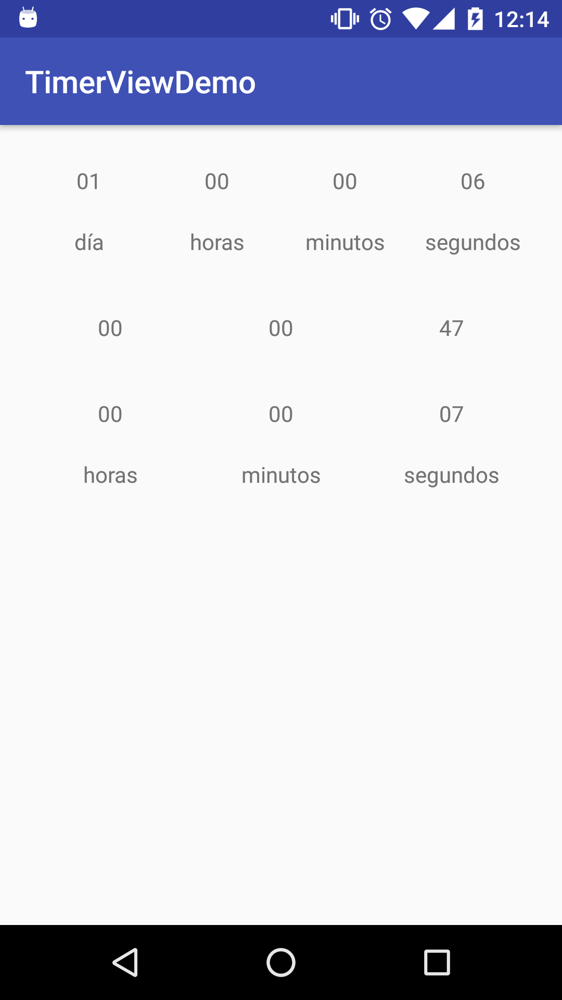
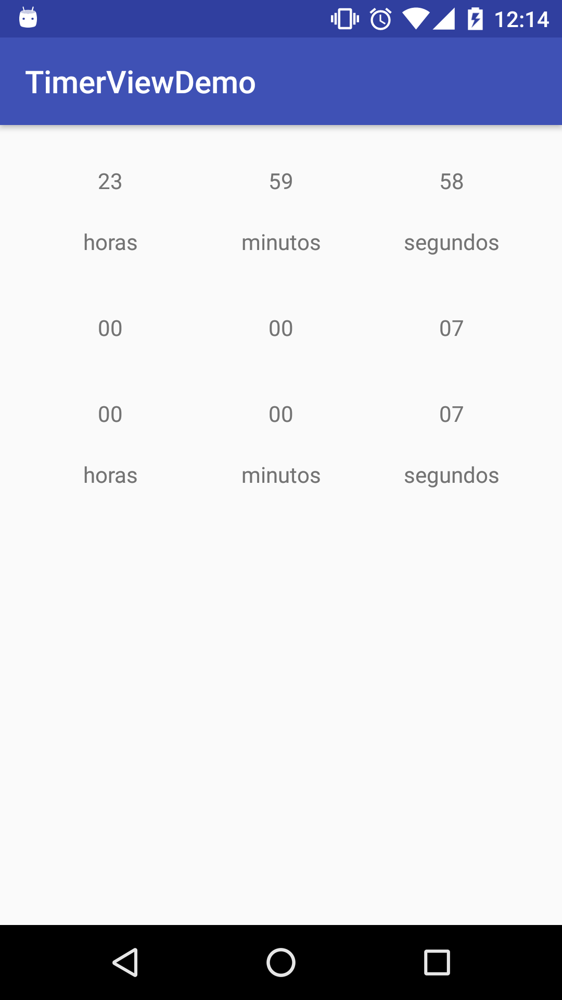
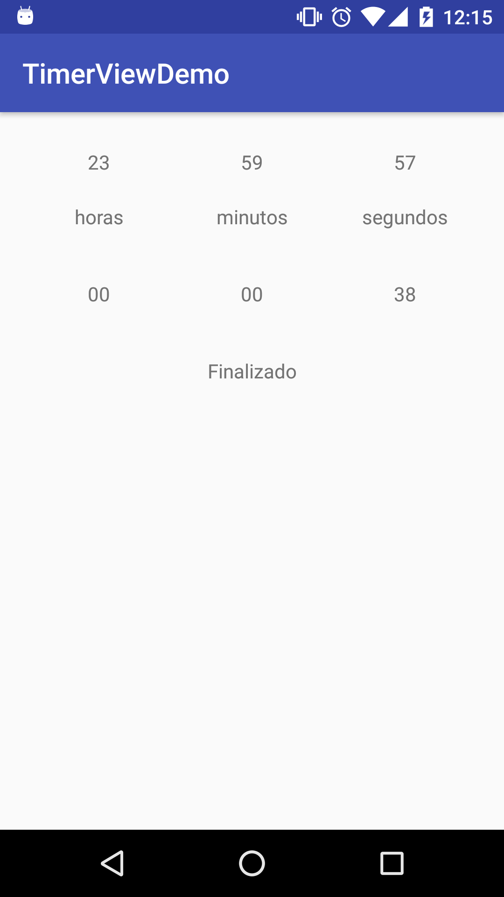

# TimerView

Add to your project build.gradle
```gradle
allprojects {
	repositories {
		...
		maven { url "https://jitpack.io" }
	}
}
```

Add to your app module build.gradle
```gradle
dependencies {
        compile 'com.github.RicardoBravoA:TimerView:1.0.0'
}
```

<p align="center">
  
  
  
</p>

Add the widget to your layout
```xml
<pe.com.orbis.timerview.TimerView
    android:id="@+id/tv1"
    android:layout_width="match_parent"
    android:layout_height="wrap_content"
    app:showDisplay="true"
    app:time="86409000"/>
```

Remember to add a namespace for the library in your layout:
```javascript
xmlns:app="http://schemas.android.com/apk/res-auto"
```

You can customize the widget from the layout file, or from the activity once you obtain a reference to it:
```java
@BindView(R.id.tv3) TimerView tv3;
ButterKnife.bind(this);

tv3.setTime(10000);
tv3.setShowDisplay(true);
tv3.setOnTimerListener(this);
```

License
--------

    Copyright © 2017 Ricardo Bravo

    Licensed under the Apache License, Version 2.0 (the "License");
    you may not use this file except in compliance with the License.
    You may obtain a copy of the License at

       http://www.apache.org/licenses/LICENSE-2.0

    Unless required by applicable law or agreed to in writing, software
    distributed under the License is distributed on an "AS IS" BASIS,
    WITHOUT WARRANTIES OR CONDITIONS OF ANY KIND, either express or implied.
    See the License for the specific language governing permissions and
    limitations under the License.